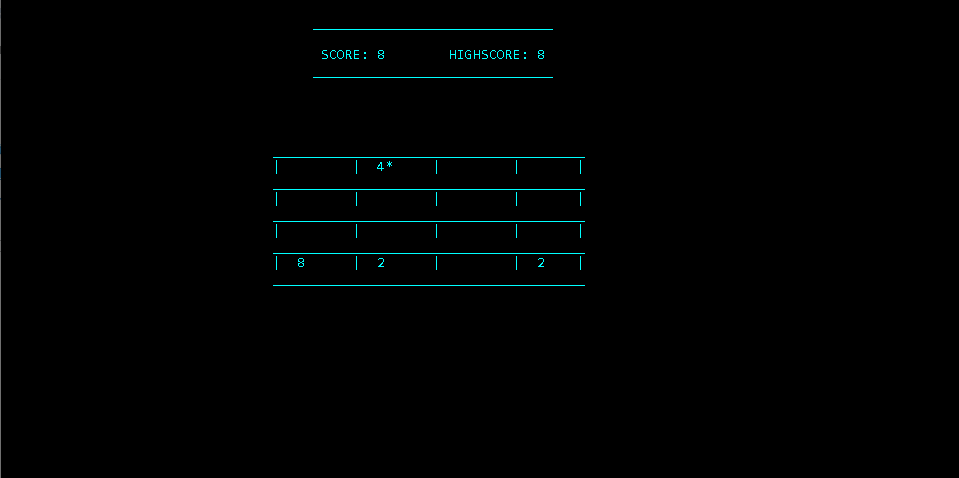

---

Büyük harflerle(Caps Lock açıkken) girilen R,E ve X geçerlidir.

R ile önceki duruma geçer (önceki durumun öncekine geçemez)

X ile sıfırlanır

E ile oyunu sonlandırır

Yön tuşları ile yön tuşuna göre işlem yapar
